# Git版本管理 <span style="font-size:20px;color:#46B">(冠华公司网络部)</span>
<span style='float:right;font-size:18px;color:#46b'>赵金海整理，如有错误请指正</span>
## 一、 SVN与Git区别
### (1)Svn是一个中心化的版本控制工具
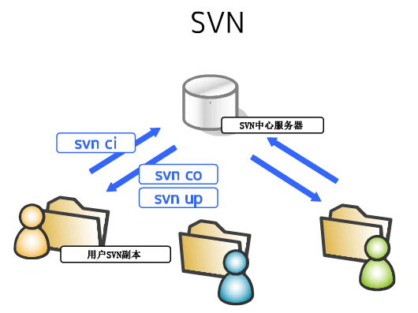  
>每一个SVN用户都可以从服务器checkout代码，同样也可以像服务器提交（commit）代码，
可以更新（update）到别人提交的代码。
- 优势：所有的操作都需要基于SVN中心服务器，所以操作起来必然很简单。
- 劣势：正因为所有的操作都要基于SVN中心服务器，所以只要SVN中心服务出现冲突（conflict）、错误（error）都会给整个团队之中的成员带来灾难
### (2) git是一个去中心化的分布式版本控制工具
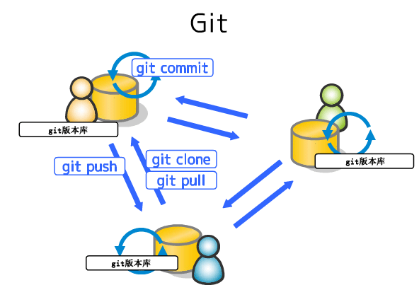  
>每一个节点都可以充当控制中心的作用，所以从GIT服务器复制（clone）一份到本地，同样也可以单独对自己的本地git版本进行单独管理。 在针对单个git版本库的操作（commit，pull）就如同SVN的commit与update操作。当然，不同版本库之间的操作就是拉取（pull），推送（push）。
## 二、Git安装
- （1）安装Git命令行管理工具Git-SCM<https://git-scm.com/> 或Git for windows <https://git-for-windows.github.io/>
- （2）安装Git GUI客户端工具tortoisegit<https://tortoisegit.org/>
-  (3) 服务器地址:  
本地服务器:https://192.168.57.27:8443/   用户:test 密码：123456  
免费服务器:www.github.com  git.oschina.net
      
## 三、Git起步
### 1、直接记录快照，而非差异比较
SVN系统每次记录有那些文件作了更新，以及更新了哪个些内容，具体如图  
  
Git只关心文件数据的整个体是否发生变化,Git 并不保存这些前后变化的差异数据。实际上，Git 更像是把变化的文件作快照后，记录在一个微型的文件系统中。每次提交更新时，它会纵览一遍所有文件的指纹信息并对文件作一快照，然后保存一个指向这次快照的索引。为提高性能，若文件没有变化，Git 不会再次保存，而只对上次保存的快照作一链接。Git 的工作方式就像图所示    
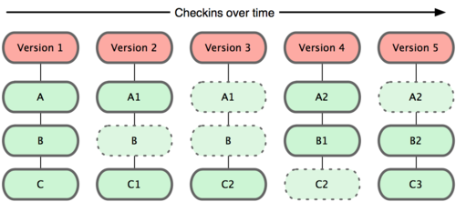  
### 2、Git配置
Git 提供了一个叫做 git config 的工具，专门用来配置或读取相应的工作环境变量。而正是由这些环境变量，决定了 Git 在各个环节的具体工作方式和行为。这些变量可以存放在以下不同的地方：
- 用户目录下的配制文件.gitconfig,该文件适用于该用户所有的项目。使用 **git config**时用--global选项，读写的是这个文件
``` sh
#实例:配置用户名为：zhaojinhai
git config --golbal use.name "zhaojinhai"
```
- 当前项目的git目录下的配置文件(就是工作目录中的./git/config):这里的配置仅仅针对当前项目有效  
每一个级别的配置都会覆盖上层的相同配置，所以 .git/config 里的配置会覆盖用户目录下的配置文件
#### a. 用户信息配置
第一个要配置的是你个人的用户名称和电子邮件地址。这两条配置很重要，每次 Git 提交时都会引用这两条信息，说明是谁提交了更新，所以会随更新内容一起被永久纳入历史记录
```
git config --global user.name "zhaojinhai"
git config --global user.email zhaojinhai@163.com
```
如果用了 --global 选项，那么更改的配置文件就是位于你用户主目录下的那个，以后你所有的项目都会默认使用这里配置的用户信息。如果要在某个特定的项目中使用其他名字或者电邮，只要去掉 --global 选项重新配置即可，新的设定保存在当前项目的 .git/config 文件里。
#### b. 差异分析工具
Git 可以理解 kdiff3，tkdiff，meld，xxdiff，emerge，vimdiff，gvimdiff，ecmerge，和 opendiff 等合并工具的输出信息，这里，如果说在解决合并冲突时使用的是vimdiff差异分析工具。改用命令如下
``` sh
git config --global merge.tool vimdiff
```
#### c. 查看配置信息
``` sh
git config --list
   #user.name=zhaojinhai
   #user.email=zhaojinhai@163.com
   #color.status=auto
   #color.branch=auto
   #color.interactive=auto
   #color.diff=auto
   #...
```
#### d.想了解 Git 的各式工具该怎么用，可以阅读它们的使用帮助,方法如下:
``` sh
# 方法1
git help
#方法二
git --help
```
比如，要学习 config 命令可以怎么用，运行
``` sh
git help config
```
## 四、Git基础

### 1、取得项目的Git仓库

有两种取得 Git 项目仓库的方法。第一种是在现存的目录下，通过导入所有文件来创建新的 Git 仓库。第二种是从已有的 Git 仓库克隆出一个新的镜像仓库来

#### a. 从工作目录中初始化新仓库

要对现有的某个项目开始用 Git 管理，只需到此项目所在的目录，执行
``` sh
git init
```
初始化后，在当前目录下会出现一个名为 .git 的目录，所有 Git 需要的数据和资源都存放在这个目录中。如果当前目录下有几个文件想要纳入版本控制，需要先用 git add 命令告诉 Git 开始对这些文件进行跟踪，然后提交
``` sh
# step 1 添加所有的文件
git add .
# step 2 新增的文件 readme 添加到仓库
git add README
# step 3 提交更新 
git commit -m '更新的注释，必填项'
```
#### b. 从现有仓库克隆

如果要对远程的项目进行修改，可以先把该项目的 Git 仓库复制一份出来，这就需要用到 git clone 命令。Git 收取项目历史的所有数据（每一个文件的每一个版本），服务器上有的数据克隆之后本地也都有了。实际上，即便服务器的磁盘发生故障，用任何一个克隆出来的客户端都可以重建服务器上的仓库，回到当初克隆时的状态
``` sh
git clone [url]
# 如 git clone ssh://zhao@192.168.57.27:29418/浪潮售前交接系统.git
```
### 2、记录每次更新到仓库

先上一张文件的状态变化周期的图示
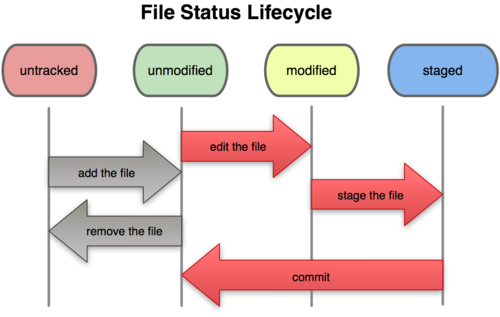

#### a. 检查当前文件状态

``` sh
git status
```
#### b. 跟踪新文件

使用命令 git add 开始跟踪一个新文件README。运行

``` sh
# step 1
git add README
# step 2
git status
# 此时文件属于暂存状态
    # On branch master
    # Changes to be committed:
    # (use "git reset HEAD <file>..." to unstage)
    # new file: README
```
假设在这之前我就已经跟踪过一个文件叫 benchmarks.rb，然后再次运行 status 命令，会看到这样的状态报告

```sh
git status
    # On branch master
    # Changes to be committed:
    # (use "git reset HEAD <file>..." to unstage)
    #
    # new file: README
    #
    # Changes not staged for commit:
    # (use "git add <file>..." to update what will be committed)
    #
    # modified: benchmarks.rb
```
文件 benchmarks.rb 出现在 “Changes not staged for commit” 这行下面，说明已跟踪文件的内容发生了变化，但还没有放到暂存区。要暂存这次更新，需要运行 git add 命令。现在让我们运行 git add 将 benchmarks.rb 放到暂存区，然后再看看 git status 的输出

```sh
# step 1
git add benchmarks.rb
# step 2
git status
    # On branch master
    # Changes to be committed:
    # (use "git reset HEAD <file>..." to unstage)
    #
    # new file: README
    # modified: benchmarks.rb
```
现在两个文件都已暂存，下次提交时就会一并记录到仓库。假设此时，你想要在 benchmarks.rb 里再加条注释，重新编辑存盘后，准备好提交。不过且慢，再运行 git status 看看

``` sh
git status
    # On branch master
    # Changes to be committed:
    # (use "git reset HEAD <file>..." to unstage)
    #
    # new file: README
    # modified: benchmarks.rb
    #
    # Changes not staged for commit:
    # (use "git add <file>..." to update what will be committed)
    #
    # modified: benchmarks.rb
```
很明显，benchmarks.rb 文件出现了两次！一次算未暂存，一次算已暂存，这怎么可能呢？好吧，实际上 Git 只不过暂存了你运行 git add命令时的版本，如果现在提交，那么提交的是添加注释前的版本，而非当前工作目录中的版本。所以，运行了 git add 之后又作了修订的文件，需要重新运行 git add 把最新版本重新暂存起来

``` sh
# step 1
git add benchmarks.rb
# step 2
git status
    # On branch master
    # Changes to be committed:
    # (use "git reset HEAD <file>..." to unstage)
    #
    # new file: README
    # modified: benchmarks.rb
```
#### c. 忽略某些文件

一般我们总会有些文件无需纳入 Git 的管理，也不希望它们总出现在未跟踪文件列表。通常都是些自动生成的文件，比如日志文件，或者编译过程中创建的临时文件等。我们可以创建一个名为 .gitignore 的文件，列出要忽略的文件模式。来看一个实际的例子
>修改 .gitignore 文件
``` sh

    #告诉 Git 忽略所有以 .o 或 .a 结尾的文件。一般这类对象文件和存档文件都是编译过程中出现的，我们用不着跟踪它们的版本
    *.[oa]
    #告诉 Git 忽略所有以波浪符（~）结尾的文件，许多文本编辑软件（比如 Emacs）都用这样的文件名保存副本
    *~

#此外，你可能还需要忽略 log，tmp 或者 pid 目录，以及自动生成的文档等等。
#要养成一开始就设置好 .gitignore 文件的习惯，以免将来误提交这类无用的文件
```
文件 .gitignore 的格式规范如下：

所有空行或者以注释符号 ＃ 开头的行都会被 Git 忽略。
可以使用标准的 glob 模式匹配。
匹配模式最后跟反斜杠（/）说明要忽略的是目录。
要忽略指定模式以外的文件或目录，可以在模式前加上惊叹号（!）取反。
所谓的 glob 模式是指 shell 所使用的简化了的正则表达式。星号（*）匹配零个或多个任意字符；[abc] 匹配任何一个列在方括号中的字符（这个例子要么匹配一个 a，要么匹配一个 b，要么匹配一个 c）；问号（?）只匹配一个任意字符；如果在方括号中使用短划线分隔两个字符，表示所有在这两个字符范围内的都可以匹配（比如 [0-9] 表示匹配所有 0 到 9 的数字）。

我们再看一个 .gitignore 文件的例子

```sh
# 此为注释 – 将被 Git 忽略
    # 忽略所有 .a 结尾的文件
    *.a
    # 但 lib.a 除外
    !lib.a
    # 仅仅忽略项目根目录下的 TODO 文件，不包括 subdir/TODO
    /TODO
    # 忽略 build/ 目录下的所有文件
    build/
    # 会忽略 doc/notes.txt 但不包括 doc/server/arch.txt
    doc/*.txt
```
#### d. 查看已暂存和未暂存的更新

实际上 git status 的显示比较简单，仅仅是列出了修改过的文件，假如再次修改 README 文件后暂存，然后编辑 benchmarks.rb 文件后先别暂存，运行 status 命令将会看到

``` sh
git status
    # On branch master
    # Changes to be committed:
    # (use "git reset HEAD <file>..." to unstage)
    #
    # new file: README
    #
    # Changes not staged for commit:
    # (use "git add <file>..." to update what will be committed)
    #
    # modified: benchmarks.rb
```
如果这个时候我需要查看尚未暂存的文件更新了哪些部分，那么不妨不加参数直接输入 git diff

``` sh
git diff
```
此命令比较的是工作目录中当前文件和暂存区域快照之间的差异，也就是修改之后还没有暂存起来的变化内容。

若要看已经暂存起来的文件和上次提交时的快照之间的差异，可以用 git diff --cached 命令。
``` sh
git diff --cached
```
#### e. 提交更新

现在的暂存区域已经准备妥当可以提交了。在此之前，请一定要确认还有什么修改过的或新建的文件还没有 git add 过，否则提交的时候不会记录这些还没暂存起来的变化。所以，每次准备提交前，先用 git status 看下，是不是都已暂存起来了，然后再运行提交命令 git commit
```
git commit
```
这种方式会启动文本编辑器以便输入本次提交的说明，编辑器会显示类似下面的文本信息（本例选用 Vim 的屏显方式展示）

```sh
# Please enter the commit message for your changes. Lines starting
    # with '#' will be ignored, and an empty message aborts the commit.
    # On branch master
    # Changes to be committed:
    # (use "git reset HEAD <file>..." to unstage)
    #
    # new file: README
    # modified: benchmarks.rb
    ~
    ~
    ~
    ".git/COMMIT_EDITMSG" 10L, 283C
```
另外也可以用 -m 参数后跟提交说明的方式，在一行命令中提交更新

git commit -m "up"
如果我们需要跳过使用暂存区域，不用担心。Git 提供了一个跳过使用暂存区域的方式，只要在提交的时候，给 git commit 加上 -a 选项，Git 就会自动把所有已经跟踪过的文件暂存起来一并提交，从而跳过 git add 步骤

```sh
# step 1
git status
    # On branch master
    #
    # Changes not staged for commit:
    #
    # modified: benchmarks.rb
    #
# step 2
git commit -a -m 'up'
    #[master 83e38c7] added new benchmarks
    #1 files changed, 5 insertions(+), 0 deletions(-)
```
#### f. 移除文件


要从 Git 中移除某个文件，就必须要从已跟踪文件清单中移除（确切地说，是从暂存区域移除），然后提交。可以用 git rm 命令完成此项工作，并连带从工作目录中删除指定的文件，这样以后就不会出现在未跟踪文件清单中了。

如果只是简单地从工作目录中手工删除文件，运行 git status 时就会在 “Changes not staged for commit” 部分（也就是未暂存清单）看到

```sh
# step 1
rm benchmarks.rb
# step 2
git status
    # On branch master
    #
    # Changes not staged for commit:
    # (use "git add/rm <file>..." to update what will be committed)
    #
    # deleted: benchmarks.rb
```
然后再运行 git rm 记录此次移除文件的操作：

``` sh
# step 1
git rm benchmarks.rb
# step 2
git status
    # On branch master
    #
    # Changes to be committed:
    # (use "git reset HEAD <file>..." to unstage)
    #
    # deleted: benchmarks.rb
```
这样最后提交的时候，该文件就不再纳入版本管理了。如果删除之前修改过并且已经放到暂存区域的话，则必须要用强制删除选项 -f（force 的首字母），以防误删除文件后丢失修改的内容。

另外一种情况是，我们想把文件从 Git 仓库中删除（亦即从暂存区域移除），但仍然希望保留在当前工作目录中。换句话说，仅是从跟踪清单中删除。比如一些大型日志文件或者一堆 .a 编译文件，不小心纳入仓库后，要移除跟踪但不删除文件，以便稍后在 .gitignore 文件中补上，用 --cached 选项即可

git rm --cached readme.txt

### 3、查看提交历史

在提交了若干更新之后，又或者克隆了某个项目，想回顾下提交历史，可以使用 git log 命令查看。

git log 
默认不用任何参数的话，git log 会按提交时间列出所有的更新，最近的更新排在最上面。

git log 命令支持的选项具体如下所示

#选项 说明
    -p 按补丁格式显示每个更新之间的差异。
    --stat 显示每次更新的文件修改统计信息。
    --shortstat 只显示 --stat 中最后的行数修改添加移除统计。
    --name-only 仅在提交信息后显示已修改的文件清单。
    --name-status 显示新增、修改、删除的文件清单。
    --abbrev-commit 仅显示 SHA-1 的前几个字符，而非所有的 40 个字符。
    --relative-date 使用较短的相对时间显示（比如，“2 weeks ago”）。
    --graph 显示 ASCII 图形表示的分支合并历史。
    --pretty 使用其他格式显示历史提交信息。可用的选项包括 oneline，short，full，fuller 和 format（后跟指定格式）。
    -(n) 仅显示最近的 n 条提交
    --since, --after 仅显示指定时间之后的提交。
    --until, --before 仅显示指定时间之前的提交。
    --author 仅显示指定作者相关的提交。
    --committer 仅显示指定提交者相关的提交。

### 4、撤销操作

有时候我们提交完了才发现漏掉了几个文件没有加，或者提交信息写错了。想要撤消刚才的提交操作，可以使用 --amend 选项重新提交：
```
git commit --amend
```
如果刚才提交时忘了暂存某些修改，可以先补上暂存操作，然后再运行 --amend 提交：

``` sh
# step 1
git commit -m 'initial commit'
# step 2
git add forgotten_file
# step 3
git commit --amend
```
上面的三条命令最终只是产生一个提交，第二个提交命令修正了第一个的提交内容。

### 5、git重置
   如何操作暂存区域与工作目录中已修改的文件。 这些命令在修改文件状态的同时，也会提示如何撤消操作。 例如，你已经修改了两个文件并且想要将它们作为两次独立的修改提交，但是却意外地输入了 git add * 暂存了它们两个。 如何只取消暂存两个中的一个呢？ git status 命令提示了你：

```sh
$ git add *
$ git status
On branch master
Changes to be committed:
  (use "git reset HEAD <file>..." to unstage)

    renamed:    README.md -> README
    modified:   CONTRIBUTING.md
```
在 `Changes to be committed'' 文字正下方，提示使用 `git reset HEAD <file>…​ 来取消暂存。 所以，我们可以这样来取消暂存 CONTRIBUTING.md 文件：

```sh
$ git reset HEAD CONTRIBUTING.md

Unstaged changes after reset:
M	CONTRIBUTING.md
$ git status
On branch master
Changes to be committed:
  (use "git reset HEAD <file>..." to unstage)

    renamed:    README.md -> README

Changes not staged for commit:
  (use "git add <file>..." to update what will be committed)
  (use "git checkout -- <file>..." to discard changes in working directory)

    modified:   CONTRIBUTING.md
```
这个命令有点儿奇怪，但是起作用了。 CONTRIBUTING.md 文件已经是修改未暂存的状态了。
>虽然在调用时加上 --hard 选项可以令 git reset 成为一个危险的命令,可能导致工作目录中所有当前进度丢失！，但本例中工作目录内的文件并不会被修改。 不加选项地调用 git reset 并不危险 — 它只会修改暂存区域。

#### 指令说明

git-reset - Reset current HEAD to the specified state

语法  

>git reset [-q] [\<tree-ish>] [--] \<paths>…​  
git reset (--patch | -p) [\<tree-ish>] [--] [\<paths>…​]  
git reset [--soft | --mixed [-N] | --hard | --merge | --keep] [-q] [\<commit>]

说明:  
\<tree-ish>/\<commit>默认值是HEAD
前两种用法不会重置引用，更不会改变工作区，而是用指定提交状态(\<tree-ish>)下的文件(\<paths>)替换掉暂存区中的文件。例如命名令 git reaset head \<paths>相当于取消之彰执行的git add \<paths>命令时改变的暂存区。  
第三种用法则会得置引用。根据不同的选项，可以对暂存区或工作区进行重置。参照下面的版本库模型图，来看一看不同的参数对第三种重置语法的影响。  
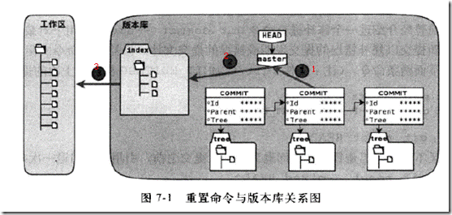

命令格式：git reset [--soft | --mixed | --hard] [<commit>]

1）使用参数--hard，如git reset --hard <commit>

会执行上图中的全部动作1、2、3，即：

- 1.替换引用的指向。引用指向新的提交ID。

- 2.替换暂存区。替换后，暂存区的内容和引用指向的目录树一致。

- 3.替换工作区。替换后，工作区的内容变得和暂存区一致，也和HEAD所指向的目录树内容相同。

2）使用参数--soft，如 git reset --soft <commit>

会执行上图中的操作①。即只更改引用的指向，不改变暂存区和工作区。

3）使用参数--mixed或者不使用参数（默认为--mixed），如 git reset <commit>

会执行上图中的操作1和2。即更改引用的指向及重置暂存区，但是不改变工作区。

### 6、git标签
Git 可以给历史中的某一个提交打上标签，以示重要。 比较有代表性的是人们会使用这个功能来标记发布结点（v1.0 等等）。

#### a. 列出标签

在 Git 中列出已有的标签是非常简单直观的。 只需要输入 git tag：
``` sh
$ git tag
v0.1
v1.3
```
这个命令以字母顺序列出标签；但是它们出现的顺序并不重要。
你也可以使用特定的模式查找标签。 例如，Git 自身的源代码仓库包含标签的数量超过 500 个。 如果只对 1.8.5 系列感兴趣，可以运行：
```
$ git tag -l 'v1.8.5*'
v1.8.5
v1.8.5-rc0
v1.8.5-rc1
v1.8.5-rc2
v1.8.5-rc3
```
#### b. 创建标签

Git 使用两种主要类型的标签：轻量标签（lightweight）与附注标签（annotated）。
一个轻量标签很像一个不会改变的分支 - 它只是一个特定提交的引用。
然而，附注标签是存储在 Git 数据库中的一个完整对象。 它们是可以被校验的；其中包含打标签者的名字、电子邮件地址、日期时间；还有一个标签信息；并且可以使用 GNU Privacy Guard （GPG）签名与验证。 通常建议创建附注标签，这样你可以拥有以上所有信息；但是如果你只是想用一个临时的标签，或者因为某些原因不想要保存那些信息，轻量标签也是可用的。

- (1)、附注标签

在 Git 中创建一个附注标签是很简单的。 最简单的方式是当你在运行 tag 命令时指定 -a 选项：
```
$ git tag -a v1.4 -m 'my version 1.4'
$ git tag
v0.1
v1.3
v1.4
```
-m 选项指定了一条将会存储在标签中的信息。 如果没有为附注标签指定一条信息，Git 会运行编辑器要求你输入信息。  
通过使用 `git show `命令可以看到标签信息与对应的提交信息：

```sh
$ git show v1.4
tag v1.4
Tagger: Ben Straub <ben@straub.cc>
Date:   Sat May 3 20:19:12 2014 -0700

my version 1.4

commit ca82a6dff817ec66f44342007202690a93763949
Author: Scott Chacon <schacon@gee-mail.com>
Date:   Mon Mar 17 21:52:11 2008 -0700

    changed the version number
```
输出显示了打标签者的信息、打标签的日期时间、附注信息，然后显示具体的提交信息。
- (2) 轻量标签

另一种给提交打标签的方式是使用轻量标签。 轻量标签本质上是将提交校验和存储到一个文件中 - 没有保存任何其他信息。 创建轻量标签，不需要使用 -a、-s 或 -m 选项，只需要提供标签名字：

```
$ git tag v1.4-lw
$ git tag
v0.1
v1.3
v1.4
v1.4-lw
v1.5
```
这时，如果在标签上运行 `git show`，你不会看到额外的标签信息。 命令只会显示出提交信息：
```
$ git show v1.4-lw
commit ca82a6dff817ec66f44342007202690a93763949
Author: Scott Chacon <schacon@gee-mail.com>
Date:   Mon Mar 17 21:52:11 2008 -0700

    changed the version number
```
- (3) 后期打标签

你也可以对过去的提交打标签。 假设提交历史是这样的：

``` sh
$ git log --pretty=oneline
15027957951b64cf874c3557a0f3547bd83b3ff6 Merge branch 'experiment'
a6b4c97498bd301d84096da251c98a07c7723e65 beginning write support
0d52aaab4479697da7686c15f77a3d64d9165190 one more thing
6d52a271eda8725415634dd79daabbc4d9b6008e Merge branch 'experiment'
0b7434d86859cc7b8c3d5e1dddfed66ff742fcbc added a commit function
4682c3261057305bdd616e23b64b0857d832627b added a todo file
166ae0c4d3f420721acbb115cc33848dfcc2121a started write support
9fceb02d0ae598e95dc970b74767f19372d61af8 updated rakefile
964f16d36dfccde844893cac5b347e7b3d44abbc commit the todo
8a5cbc430f1a9c3d00faaeffd07798508422908a updated readme
```
现在，假设在 v1.2 时你忘记给项目打标签，也就是在 ``updated rakefile'' 提交。 你可以在之后补上标签。 要在那个提交上打标签，你需要在命令的末尾指定提交的校验和（或部分校验和）:

``` sh
$ git tag -a v1.2 9fceb02
# 可以看到你已经在那次提交上打上标签了：
$ git tag
v0.1
v1.2
v1.3
v1.4
v1.4-lw
v1.5

$ git show v1.2
tag v1.2
Tagger: Scott Chacon <schacon@gee-mail.com>
Date:   Mon Feb 9 15:32:16 2009 -0800

version 1.2
commit 9fceb02d0ae598e95dc970b74767f19372d61af8
Author: Magnus Chacon <mchacon@gee-mail.com>
Date:   Sun Apr 27 20:43:35 2008 -0700

    updated rakefile
...
```
- (4) 共享标签

默认情况下，git push 命令并不会传送标签到远程仓库服务器上。 在创建完标签后你必须显式地推送标签到共享服务器上。 这个过程就像共享远程分支一样 - 你可以运行 `git push origin [tagname]`。

```sh
$ git push origin v1.5
Counting objects: 14, done.
Delta compression using up to 8 threads.
Compressing objects: 100% (12/12), done.
Writing objects: 100% (14/14), 2.05 KiB | 0 bytes/s, done.
Total 14 (delta 3), reused 0 (delta 0)
To git@github.com:schacon/simplegit.git
 * [new tag]         v1.5 -> v1.5
 ```
如果想要一次性推送很多标签，也可以使用带有 --tags 选项的 git push 命令。 这将会把所有不在远程仓库服务器上的标签全部传送到那里。

```sh
$ git push origin --tags
Counting objects: 1, done.
Writing objects: 100% (1/1), 160 bytes | 0 bytes/s, done.
Total 1 (delta 0), reused 0 (delta 0)
To git@github.com:schacon/simplegit.git
 * [new tag]         v1.4 -> v1.4
 * [new tag]         v1.4-lw -> v1.4-lw
 ```
现在，当其他人从仓库中克隆或拉取，他们也能得到你的那些标签。
-(5)检出标签

在 Git 中你并不能真的检出一个标签，因为它们并不能像分支一样来回移动。 如果你想要工作目录与仓库中特定的标签版本完全一样，可以使用 `git checkout -b [branchname] [tagname]` 在特定的标签上创建一个新分支：
```sh
$ git checkout -b version2 v2.0.0
Switched to a new branch 'version2'
```
当然，如果在这之后又进行了一次提交，version2 分支会因为改动向前移动了，那么 version2 分支就会和 v2.0.0 标签稍微有些不同，这时就应该当心了。
## 五、远程仓库的使用
### 1、查看当前的远程仓库

要查看当前配置有哪些远程仓库，可以用 `git remote` 命令，它会列出每个远程库的简短名字。在克隆完某个项目后，至少可以看到一个名为 origin 的远程库，Git 默认使用这个名字来标识你所克隆的原始仓库
```sh
# step 1
$ git clone https://github.com/xuqiang521/data-visualization.git     
  #Cloning into 'data-visualization'...
  #remote: Counting objects: 38, done.
  #remote: Compressing objects: 100% (29/29), done.
  #remote: Total 38 (delta 7), reused 38 (delta 7), pack-reused 0
  #Unpacking objects: 100% (38/38), done.
# step 2
$ cd data-visualization
# step 3
$ git remote
    #origin
```
也可以加上 -v 选项（译注：此为 --verbose 的简写，取首字母），显示对应的克隆地址：
```
$ git remote -v                                                        
#origin	https://github.com/xuqiang521/data-visualization.git (fetch)
#origin	https://github.com/xuqiang521/data-visualization.git (push)
```
如果有多个远程仓库，此命令也可以将其全部列出。这样一来，我就可以非常轻松地从这些用户的仓库中，拉取他们的提交到本地。

### 2、添加远程仓库

要添加一个新的远程仓库，可以指定一个简单的名字，以便将来引用，运行 `git remote add [shortname] [url]`：

```sh
# step 1
$ git remote
    #origin
# step 2
$ git remote add pb git://github.com/paulboone/ticgit.git
# step 3
$ git remote -v
    #origin git://github.com/schacon/ticgit.git
    #pb git://github.com/paulboone/ticgit.git
```
现在可以用字符串 pb 指代对应的仓库地址了。比如说，要抓取所有 Paul 有的，但本地仓库没有的信息，可以运行 `git fetch pb`：

```sh
$ git fetch pb
    #remote: Counting objects: 58, done.
    #remote: Compressing objects: 100% (41/41), done.
    #remote: Total 44 (delta 24), reused 1 (delta 0)
    #Unpacking objects: 100% (44/44), done.
    #From git://github.com/paulboone/ticgit
    #* [new branch] master -> pb/master
    #* [new branch] ticgit -> pb/ticgit
```
现在，Paul 的主干分支（master）已经完全可以在本地访问了，对应的名字是 pb/master，你可以将它合并到自己的某个分支，或者切换到这个分支，看看有些什么有趣的更新。

### 3、从远程仓库抓取数据

正如之前所看到的，可以用下面的命令从远程仓库抓取数据到本地：

> git fetch [remote-name]  

此命令会到远程仓库中拉取所有你本地仓库中还没有的数据。运行完成后，你就可以在本地访问该远程仓库中的所有分支，将其中某个分支合并到本地，或者只是取出某个分支，一探究竟。

如果是克隆了一个仓库，此命令会自动将远程仓库归于 origin 名下。所以，git fetch origin 会抓取从你上次克隆以来别人上传到此远程仓库中的所有更新（或是上次 fetch 以来别人提交的更新）。有一点很重要，需要记住，fetch 命令只是将远端的数据拉到本地仓库，并不自动合并到当前工作分支，只有当你确实准备好了，才能手工合并。

如果设置了某个分支用于跟踪某个远端仓库的分支，可以使用 git pull 命令自动抓取数据下来，然后将远端分支自动合并到本地仓库中当前分支。在日常工作中我们经常这么用，既快且好。实际上，默认情况下 git clone 命令本质上就是自动创建了本地的 master 分支用于跟踪远程仓库中的 master 分支（假设远程仓库确实有 master 分支）。所以一般我们运行 git pull，目的都是要从原始克隆的远端仓库中抓取数据后，合并到工作目录中的当前分支。

4、推送数据到远程仓库

项目进行到一个阶段，要同别人分享目前的成果，可以将本地仓库中的数据推送到远程仓库。实现这个任务的命令很简单： `git push [remote-name] [branch-name]`。如果要把本地的 master 分支推送到 origin 服务器上（再次说明下，克隆操作会自动使用默认的 master 和 origin 名字），可以运行下面的命令：

> git push origin master

只有在所克隆的服务器上有写权限，或者同一时刻没有其他人在推数据，这条命令才会如期完成任务。如果在你推数据前，已经有其他人推送了若干更新，那你的推送操作就会被驳回。你必须先把他们的更新抓取到本地，合并到自己的项目中，然后才可以再次推送。

5、查看远程仓库信息

我们可以通过命令 `git remote show [remote-name]` 查看某个远程仓库的详细信息，比如要看所克隆的 origin 仓库，可以运行：

```sh
$ git remote show origin
    #* remote origin
    #Fetch URL: https://github.com/xuqiang521/data-visualization.git
    #Push  URL: https://github.com/xuqiang521/data-visualization.git
    #HEAD branch: master
    #Remote branch:
    #  master tracked
    #Local branch configured for 'git pull':
    #  master merges with remote master
    #Local ref configured for 'git push':
    #  master pushes to master (up to date)
```
除了对应的克隆地址外，它还给出了许多额外的信息。它友善地告诉你如果是在 master 分支，就可以用 git pull 命令抓取数据合并到本地。另外还列出了所有处于跟踪状态中的远端分支。

上面的例子非常简单，而随着使用 Git 的深入，git remote show 给出的信息可能会像这样：

```sh
$ git remote show origin
    #* remote origin
    #URL: git@github.com:defunkt/github.git
    #Remote branch merged with 'git pull' while on branch issues
    #issues
    #Remote branch merged with 'git pull' while on branch master
    #master
    #New remote branches (next fetch will store in remotes/origin)
    #caching
    #Stale tracking branches (use 'git remote prune')
    #libwalker
    #walker2
    #Tracked remote branches
    #acl
    #apiv2
    #dashboard2
    #issues
    #master
    #postgres
    #Local branch pushed with 'git push'
    #master:master
```
它告诉我们，运行 git push 时缺省推送的分支是什么（译注：最后两行）。它还显示了有哪些远端分支还没有同步到本地（译注：第六行的 caching 分支），哪些已同步到本地的远端分支在远端服务器上已被删除（译注：Stale tracking branches 下面的两个分支），以及运行 `git pull` 时将自动合并哪些分支（译注：前四行中列出的 issues 和 master 分支）。

6、远程仓库的删除和重命名

在新版 Git 中可以用 `git remote rename` 命令修改某个远程仓库在本地的简称，比如想把 pb 改成 paul，可以这么运行：

```sh
# step 1
$ git remote rename pb paul
# step 2
$ git remote
    #origin
    #paul
```
注意，对远程仓库的重命名，也会使对应的分支名称发生变化，原来的 pb/master 分支现在成了 paul/master。

碰到远端仓库服务器迁移，或者原来的克隆镜像不再使用，又或者某个参与者不再贡献代码，那么需要移除对应的远端仓库，可以运行 git remote rm 命令：

```sh
# step 1
$ git remote rm paul
# step 2
$ git remote
    #origin
```
## 六、Git分支

### 1、何为分支

为了理解 Git 分支的实现方式，我们需要回顾一下 Git 是如何储存数据的。看过我上一篇博客的朋友应该知道，Git 保存的不是文件差异或者变化量，而只是一系列文件快照。

在 Git 中提交时，会保存一个提交（commit）对象，该对象包含一个指向暂存内容快照的指针，包含本次提交的作者等相关附属信息，包含零个或多个指向该提交对象的父对象指针：首次提交是没有直接祖先的，普通提交有一个祖先，由两个或多个分支合并产生的提交则有多个祖先。

为直观起见，我们假设在工作目录中有三个文件，准备将它们暂存后提交。暂存操作会对每一个文件计算校验和，然后把当前版本的文件快照保存到 Git 仓库中（Git 使用 blob 类型的对象存储这些快照），并将校验和加入暂存区域：

```sh
# step 1
$ git add README test.rb LICENSE
# step 2
$ git commit -m 'initial commit of my project'
```
当使用 `git commit` 新建一个提交对象前，Git 会先计算每一个子目录的校验和，然后在 Git 仓库中将这些目录保存为树（tree）对象。之后 Git 创建的提交对象，除了包含相关提交信息以外，还包含着指向这个树对象（项目根目录）的指针，如此它就可以在将来需要的时候，重现此次快照的内容了。

现在，Git 仓库中有五个对象：三个表示文件快照内容的 blob 对象；一个记录着目录树内容及其中各个文件对应 blob 对象索引的 tree 对象；以及一个包含指向 tree 对象（根目录）的索引和其他提交信息元数据的 commit 对象。概念上来说，仓库中的各个对象保存的数据和相互关系看起来如图2-1所示：

  

图 1. 单个提交对象在仓库中的数据结构

作些修改后再次提交，那么这次的提交对象会包含一个指向上次提交对象的指针（译注：即下图中的 parent 对象）。两次提交后，仓库历史会变成图2-2的样子：

  

图 2. 多个提交对象之间的链接关系

现在来谈分支。Git 中的分支，其实本质上仅仅是个指向 commit 对象的可变指针。Git 会使用 master 作为分支的默认名字。在若干次提交后，你其实已经有了一个指向最后一次提交对象的 master 分支，它在每次提交的时候都会自动向前移动。


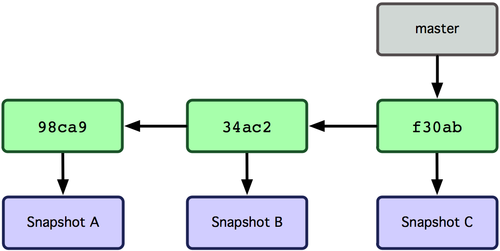

图3.分支其实就是从某个提交对象往回看的历史

那么，Git 又是如何创建一个新的分支的呢？答案很简单，创建一个新的分支指针。比如新建一个 testing 分支，可以使用 git branch 命令：

`$ git branch testing`  
这会在当前 commit 对象上新建一个分支指针（见图4）。

 
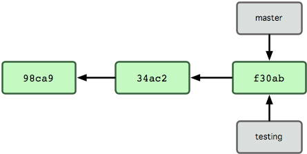

图 4. 多个分支指向提交数据的历史

那么，Git 是如何知道你当前在哪个分支上工作的呢？其实答案也很简单，它保存着一个名为 HEAD 的特别指针。请注意它和你熟知的许多其他版本控制系统（比如 Subversion 或 CVS）里的 HEAD 概念大不相同。在 Git 中，它是一个指向你正在工作中的本地分支的指针。运行 git branch 命令，仅仅是建立了一个新的分支，但不会自动切换到这个分支中去，所以在这个例子中，我们依然还在 master 分支里工作（参考图 5）
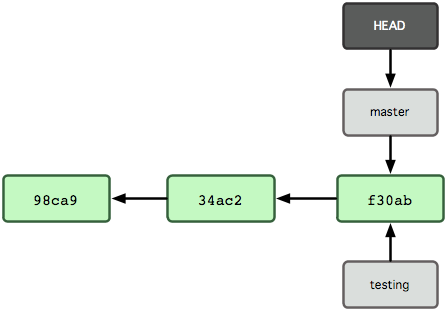

图 5. HEAD 指向当前所在的分支

要切换到其他分支，可以执行 `git checkout` 命令。我们现在转换到新建的 testing 分支：

`$ git checkout testing`  
这样 HEAD 就指向了 testing 分支（见图6）。

 
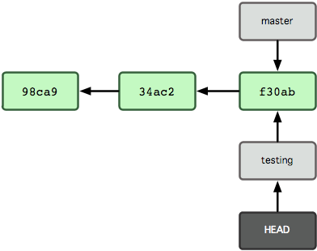

图 6. HEAD 在你转换分支时指向新的分支

这样的实现方式会给我们带来什么好处呢？好吧，现在不妨再提交一次：
```sh
# step 1
$ vim test.rb
# step 2
$ git commit -a -m 'made a change'
```
图 7 展示了提交后的结果  
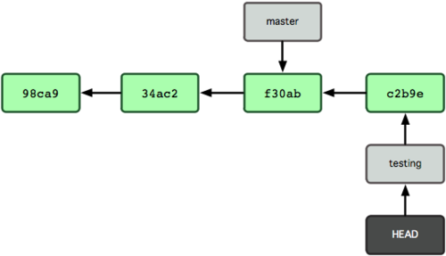  

图 7. 每次提交后 HEAD 随着分支一起向前移动

非常有趣，现在 testing 分支向前移动了一格，而 master 分支仍然指向原先 git checkout 时所在的 commit 对象。现在我们回到 master 分支看看：

    $ git checkout master
图 8 显示了结果。

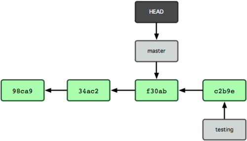  


图 8. HEAD 在一次 checkout 之后移动到了另一个分支

这条命令做了两件事。它把 HEAD 指针移回到 master 分支，并把工作目录中的文件换成了 master 分支所指向的快照内容。也就是说，现在开始所做的改动，将始于本项目中一个较老的版本。它的主要作用是将 testing 分支里作出的修改暂时取消，这样你就可以向另一个方向进行开发。

我们作些修改后再次提交：

```sh
# step 1
$ vim test.js
# step 2
$ git commit -a -m 'made other changes'
```
现在我们的项目提交历史产生了分叉（如图 2-9 所示），因为刚才我们创建了一个分支，转换到其中进行了一些工作，然后又回到原来的主分支进行了另外一些工作。这些改变分别孤立在不同的分支里：我们可以在不同分支里反复切换，并在时机成熟时把它们合并到一起。而所有这些工作，仅仅需要branch 和 checkout 这两条命令就可以完成。


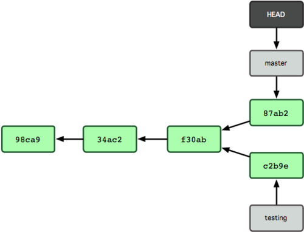   

图 9. 不同流向的分支历史

### 2、分支的新建与合并

现在让我们来看一个简单的分支与合并的例子，实际工作中大体也会用到这样的工作流程：  
开发某个网站。  
- 为实现某个新的需求，创建一个分支。  
- 在这个分支上开展工作。  
- 假设此时，你突然接到一个电话说有个很严重的问题需要紧急修补  

 那么可以按照下面的方式处理:

- 返回到原先已经发布到生产服务器上的分支。
- 为这次紧急修补建立一个新分支，并在其中修复问题。
- 通过测试后，回到生产服务器所在的分支，将修补分支合并进来，然后再推送到生产服务器上。
- 切换到之前实现新需求的分支，继续工作。
#### a.分支的新建与切换

首先，我们假设你正在项目中愉快地工作，并且已经提交了几次更新（见图10）。

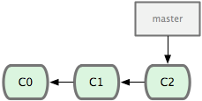    
图 10. 一个简短的提交历史

现在，你决定要修补问题追踪系统上的 #53 问题。顺带说明下，Git 并不同任何特定的问题追踪系统打交道。这里为了说明要解决的问题，才把新建的分支取名为 iss53。要新建并切换到该分支，运行 `git checkout` 并加上 -b 参数：

```sh
$ git checkout -b iss53
    #Switched to a new branch "iss53"
```
这相当于执行下面这两条命令：

```sh
# step 1
$ git branch iss53
# step 2
$ git checkout iss53
```
图 11 示意该命令的执行结果。  
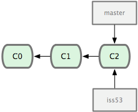    

图 11. 创建了一个新分支的指针

接着你开始尝试修复问题，在提交了若干次更新后，iss53 分支的指针也会随着向前推进，因为它就是当前分支（换句话说，当前的 HEAD 指针正指向 iss53，见图 12）：
```sh
# step 1
$ vim index.html
# step 2
$ git commit -a -m 'added a new footer [issue 53]'
```
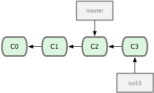  
图 12. iss53 分支随工作进展向前推进

现在你就接到了那个网站问题的紧急电话，需要马上修补。有了 Git ，我们就不需要同时发布这个补丁和 iss53 里作出的修改，也不需要在创建和发布该补丁到服务器之前花费大力气来复原这些修改。唯一需要的仅仅是切换回 master 分支。

不过在此之前，留心你的暂存区或者工作目录里，那些还没有提交的修改，它会和你即将检出的分支产生冲突从而阻止 Git 为你切换分支。切换分支的时候最好保持一个清洁的工作区域。稍后会介绍几个绕过这种问题的办法（分别叫做 stashing 和 commit amending）。目前已经提交了所有的修改，所以接下来可以正常转换到 master 分支：

```sh
$ git checkout master
    #Switched to branch "master"
```
此时工作目录中的内容和你在解决问题 #53 之前一模一样，你可以集中精力进行紧急修补。这一点值得牢记：Git 会把工作目录的内容恢复为检出某分支时它所指向的那个提交对象的快照。它会自动添加、删除和修改文件以确保目录的内容和你当时提交时完全一样。

接下来，你得进行紧急修补。我们创建一个紧急修补分支 hotfix 来开展工作，直到搞定（见图 13）：

```sh
# step 1
$ git checkout -b 'hotfix'
    #Switched to a new branch "hotfix"
# step 2
$ vim index.html
# step 3
$ git commit -a -m 'fixed the broken email address'
    #[hotfix]: created 3a0874c: "fixed the broken email address"
    #1 files changed, 0 insertions(+), 1 deletions(-)
```  
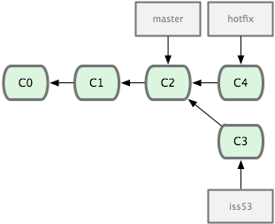    

图 13. hotfix 分支是从 master 分支所在点分化出来的

有必要作些测试，确保修补是成功的，然后回到 master 分支并把它合并进来，然后发布到生产服务器。用 `git merge` 命令来进行合并：

```sh
# step 1
$ git checkout master
# step 2
$ git merge hotfix
    #Updating f42c576..3a0874c
    #Fast forward
    #README | 1 -
    #1 files changed, 0 insertions(+), 1 deletions(-)
```
请注意，合并时出现了“Fast forward”的提示。由于当前 master 分支所在的提交对象是要并入的 hotfix 分支的直接上游，Git 只需把 master分支指针直接右移。换句话说，如果顺着一个分支走下去可以到达另一个分支的话，那么 Git 在合并两者时，只会简单地把指针右移，因为这种单线的历史分支不存在任何需要解决的分歧，所以这种合并过程可以称为快进（Fast forward）。

现在最新的修改已经在当前 master 分支所指向的提交对象中了，可以部署到生产服务器上去了（见图 14）。

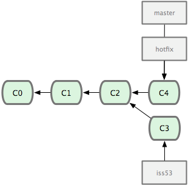  

图 14. 合并之后，master 分支和 hotfix 分支指向同一位置。

在那个超级重要的修补发布以后，你想要回到被打扰之前的工作。由于当前 hotfix 分支和 master 都指向相同的提交对象，所以 hotfix 已经完成了历史使命，可以删掉了。使用 `git branch `的 -d 选项执行删除操作：

```sh
$ git branch -d hotfix
    #Deleted branch hotfix (3a0874c).
```
现在回到之前未完成的 #53 问题修复分支上继续工作（图 15）：

```sh
# step 1
$ git checkout iss53
    #Switched to branch "iss53"
# step 2
$ vim index.html
# step 3
$ git commit -a -m 'finished the new footer [issue 53]'
    #[iss53]: created ad82d7a: "finished the new footer [issue 53]"
    #1 files changed, 1 insertions(+), 0 deletions(-)
```
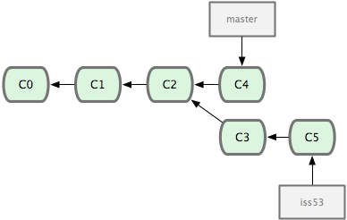  
图 15. iss53 分支可以不受影响继续推进。

不用担心之前 hotfix 分支的修改内容尚未包含到 iss53 中来。如果确实需要纳入此次修补，可以用 `git merge master` 把 master 分支合并到 iss53；或者等 iss53 完成之后，再将 iss53 分支中的更新并入 master。

#### b.分支的合并

在问题 #53 相关的工作完成之后，可以合并回 master 分支。实际操作同前面合并 hotfix 分支差不多，只需回到 master 分支，运行git merge 命令指定要合并进来的分支：
```sh
# step 1
$ git checkout master
# step 2
$ git merge iss53
    #Merge made by recursive.
    #README | 1 +
    #1 files changed, 1 insertions(+), 0 deletions(-)
```
请注意，这次合并操作的底层实现，并不同于之前 hotfix 的并入方式。因为这次你的开发历史是从更早的地方开始分叉的。由于当前 master 分支所指向的提交对象（C4）并不是 iss53 分支的直接祖先，Git 不得不进行一些额外处理。就此例而言，Git 会用两个分支的末端（C4 和 C5）以及它们的共同祖先（C2）进行一次简单的三方合并计算。图 16 用红框标出了 Git 用于合并的三个提交对象：
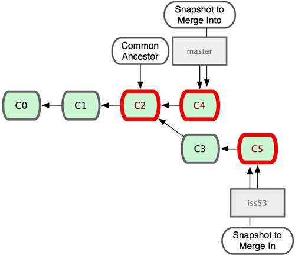  

图 16. Git 为分支合并自动识别出最佳的同源合并点。

这次，Git 没有简单地把分支指针右移，而是对三方合并后的结果重新做一个新的快照，并自动创建一个指向它的提交对象（C6）（见图 17）。这个提交对象比较特殊，它有两个祖先（C4 和 C5）。

值得一提的是 Git 可以自己裁决哪个共同祖先才是最佳合并基础；这和 CVS 或 Subversion（1.5 以后的版本）不同，它们需要开发者手工指定合并基础。所以此特性让 Git 的合并操作比其他系统都要简单不少。

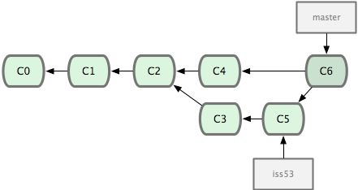 

图 2-17. Git 自动创建了一个包含了合并结果的提交对象。

既然之前的工作成果已经合并到 master 了，那么 iss53 也就没用了。你可以就此删除它，并在问题追踪系统里关闭该问题。
```sh
$ git branch -d iss53
```
#### c. 遇到冲突时的分支合并

有时候合并操作并不会如此顺利。如果在不同的分支中都修改了同一个文件的同一部分，Git 就无法干净地把两者合到一起。如果你在解决问题 #53 的过程中修改了 hotfix 中修改的部分，将得到类似下面的结果：
```sh
$ git merge iss53
    #Auto-merging index.html
    #CONFLICT (content): Merge conflict in index.html
    #Automatic merge failed; fix conflicts and then commit the result.
Git 作了合并，但没有提交，它会停下来等你解决冲突。要看看哪些文件在合并时发生冲突，可以用 git status 查阅：

[master*]$ git status
    # index.html: needs merge
    # On branch master
    # Changes not staged for commit:
    # (use "git add <file>..." to update what will be committed)
    # (use "git checkout -- <file>..." to discard changes in working directory)
    #
    # unmerged: index.html
    #
```
任何包含未解决冲突的文件都会以未合并（unmerged）的状态列出。Git 会在有冲突的文件里加入标准的冲突解决标记，可以通过它们来手工定位并解决这些冲突。可以看到此文件包含类似下面这样的部分：
```html
<<<<<<< HEAD:index.html
    <div id="footer">contact : email.support@github.com</div>
    =======
    <div id="footer">
    please contact us at support@github.com
    </div>
    >>>>>>> iss53:index.html
```
可以看到 ======= 隔开的上半部分，是 HEAD（即 master 分支，在运行 merge 命令时所切换到的分支）中的内容，下半部分是在 iss53分支中的内容。解决冲突的办法无非是二者选其一或者由你亲自整合到一起。比如你可以通过把这段内容替换为下面这样来解决：
```html
<div id="footer">
    please contact us at email.support@github.com
</div>
```
这个解决方案各采纳了两个分支中的一部分内容，而且我还删除了 <<<<<<<，======= 和 >>>>>>> 这些行。在解决了所有文件里的所有冲突后，运行 git add 将把它们标记为已解决状态（实际上就是来一次快照保存到暂存区域）。因为一旦暂存，就表示冲突已经解决。

再运行一次 git status 来确认所有冲突都已解决：
```sh
$ git status
    # On branch master
    # Changes to be committed:
    # (use "git reset HEAD <file>..." to unstage)
    #
    # modified: index.html
    #
```
如果觉得满意了，并且确认所有冲突都已解决，也就是进入了暂存区，就可以用 git commit 来完成这次合并提交。提交的记录差不多是这样：
```sh
# Merge branch 'iss53'

   # Conflicts:
   # index.html
    #
    # It looks like you may be committing a MERGE.
    # If this is not correct, please remove the file
    # .git/MERGE_HEAD
    # and try again.
    #
```
如果想给将来看这次合并的人一些方便，可以修改该信息，提供更多合并细节。比如你都作了哪些改动，以及这么做的原因。有时候裁决冲突的理由并不直接或明显，有必要略加注解。

### 3、分支的管理

到目前为止，你已经学会了如何创建、合并和删除分支。除此之外，我们还需要学习如何管理分支，在日后的常规工作中会经常用到下面介绍的管理命令。

`git branch` 命令不仅仅能创建和删除分支，如果不加任何参数，它会给出当前所有分支的清单：

```sh
$ git branch
   # iss53
   # * master
   # testing
```
注意看 master 分支前的 * 字符：它表示当前所在的分支。也就是说，如果现在提交更新，master 分支将随着开发进度前移。若要查看各个分支最后一个提交对象的信息，运行 

>git branch -v：

```sh
$ git branch -v
    #iss53 93b412c fix javascript issue
    #* master 7a98805 Merge branch 'iss53'
    #testing 782fd34 add qiangdada to the author list in the readmes
```
要从该清单中筛选出你已经（或尚未）与当前分支合并的分支，可以用 --merge 和 --no-merged 选项（Git 1.5.6 以上版本）。比如用 `git branch --merge` 查看哪些分支已被并入当前分支

```sh
$ git branch --merged
    # iss53
    # * master
```
之前我们已经合并了 iss53，所以在这里会看到它。一般来说，列表中没有 * 的分支通常都可以用 git branch -d 来删掉。原因很简单，既然已经把它们所包含的工作整合到了其他分支，删掉也不会损失什么。

另外可以用 `git branch --no-merged` 查看尚未合并的工作：

```sh
$ git branch --no-merged
   # testing
```
它会显示还未合并进来的分支。由于这些分支中还包含着尚未合并进来的工作成果，所以简单地用 git branch -d 删除该分支会提示错误，因为那样做会丢失数据：

```sh
$ git branch -d testing
   # error: The branch 'testing' is not an ancestor of your current HEAD.
   # If you are sure you want to delete it, run 'git branch -D testing'.
```
不过，如果你确实想要删除该分支上的改动，可以用大写的删除选项 -D 强制执行，就像上面提示信息中给出的那样。

### 4、利用分支进行开发的工作流程

#### a.长期分支

由于 Git 使用简单的三方合并，所以就算在较长一段时间内，反复多次把某个分支合并到另一分支，也不是什么难事。也就是说，你可以同时拥有多个开放的分支，每个分支用于完成特定的任务，随着开发的推进，你可以随时把某个特性分支的成果并到其他分支中。

许多使用 Git 的开发者都喜欢用这种方式来开展工作，比如仅在 master 分支中保留完全稳定的代码，即已经发布或即将发布的代码。与此同时，他们还有一个名为 develop 或 next 的平行分支，专门用于后续的开发，或仅用于稳定性测试 — 当然并不是说一定要绝对稳定，不过一旦进入某种稳定状态，便可以把它合并到 master 里。这样，在确保这些已完成的特性分支（短期分支，比如之前的 iss53 分支）能够通过所有测试，并且不会引入更多错误之后，就可以并到主干分支中，等待下一次的发布。

本质上我们刚才谈论的，是随着提交对象不断右移的指针。稳定分支的指针总是在提交历史中落后一大截，而前沿分支总是比较靠前（见图 18）。

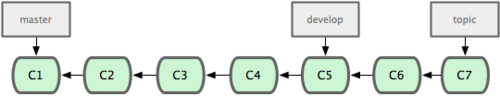   

图 18. 稳定分支总是比较老旧。

或者把它们想象成工作流水线，或许更好理解一些，经过测试的提交对象集合被遴选到更稳定的流水线（见图19）。

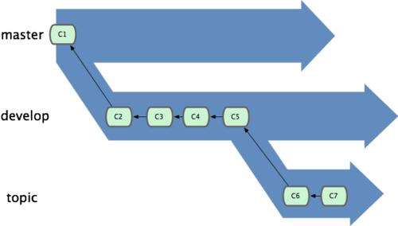   

图 19. 想象成流水线可能会容易点。

你可以用这招维护不同层次的稳定性。某些大项目还会有个 proposed（建议）或 pu（proposed updates，建议更新）分支，它包含着那些可能还没有成熟到进入 next 或 master 的内容。这么做的目的是拥有不同层次的稳定性：当这些分支进入到更稳定的水平时，再把它们合并到更高层分支中去。再次说明下，使用多个长期分支的做法并非必需，不过一般来说，对于特大型项目或特复杂的项目，这么做确实更容易管理。

#### b.特性分支

在任何规模的项目中都可以使用特性（Topic）分支。一个特性分支是指一个短期的，用来实现单一特性或与其相关工作的分支。可能你在以前的版本控制系统里从未做过类似这样的事情，因为通常创建与合并分支消耗太大。然而在 Git 中，一天之内建立、使用、合并再删除多个分支是常见的事。

现在我们来看一个实际的例子。请看图 20，由下往上，起先我们在 master 工作到 C1，然后开始一个新分支 iss91 尝试修复 91 号缺陷，提交到 C6 的时候，又冒出一个解决该问题的新办法，于是从之前 C4 的地方又分出一个分支 iss91v2，干到 C8 的时候，又回到主干 master 中提交了 C9 和 C10，再回到 iss91v2 继续工作，提交 C11，接着，又冒出个不太确定的想法，从 master 的最新提交 C10 处开了个新的分支 dumbidea 做些试验。

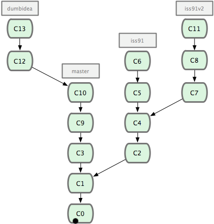 

图 20. 拥有多个特性分支的提交历史。

现在，假定两件事情：我们最终决定使用第二个解决方案，即 iss91v2 中的办法；另外，我们把 dumbidea 分支拿给同事们看了以后，发现它竟然是个天才之作。所以接下来，我们准备抛弃原来的 iss91 分支（实际上会丢弃 C5 和 C6），直接在主干中并入另外两个分支。最终的提交历史将变成图 21 这样：

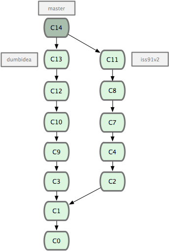 

图 21. 合并了 dumbidea 和 iss91v2 后的分支历史。

请务必牢记这些分支全部都是本地分支，这一点很重要。当你在使用分支及合并的时候，一切都是在你自己的 Git 仓库中进行的 — 完全不涉及与服务器的交互。

### 5、远程分支

远程分支（remote branch）是对远程仓库中的分支的索引。它们是一些无法移动的本地分支；只有在 Git 进行网络交互时才会更新。远程分支就像是书签，提醒着你上次连接远程仓库时上面各分支的位置。

我们用 (远程仓库名)/(分支名) 这样的形式表示远程分支。比如我们想看看上次同 origin 仓库通讯时 master 分支的样子，就应该查看origin/master 分支。如果你和同伴一起修复某个问题，但他们先推送了一个 iss53 分支到远程仓库，虽然你可能也有一个本地的 iss53 分支，但指向服务器上最新更新的却应该是 origin/iss53 分支。

可能有点乱，我们不妨举例说明。假设你们团队有个地址为 git.ourcompany.com 的 Git 服务器。如果你从这里克隆，Git 会自动为你将此远程仓库命名为 origin，并下载其中所有的数据，建立一个指向它的 master 分支的指针，在本地命名为 origin/master，但你无法在本地更改其数据。接着，Git 建立一个属于你自己的本地 master 分支，始于 origin 上 master 分支相同的位置，你可以就此开始工作（见图 22）：

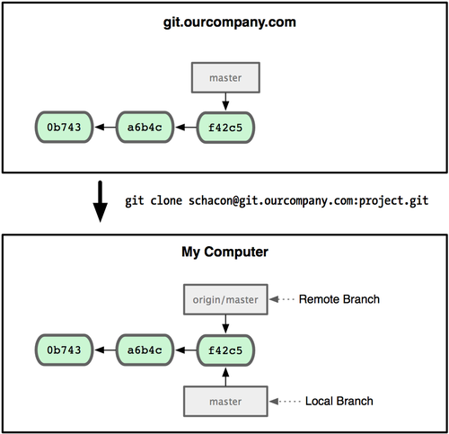 

图 22. 一次 Git 克隆会建立你自己的本地分支 master 和远程分支 origin/master，并且将它们都指向 origin 上的 master 分支。

如果你在本地 master 分支做了些改动，与此同时，其他人向 git.ourcompany.com 推送了他们的更新，那么服务器上的 master 分支就会向前推进，而于此同时，你在本地的提交历史正朝向不同方向发展。不过只要你不和服务器通讯，你的 origin/master 指针仍然保持原位不会移动（见图 23）。

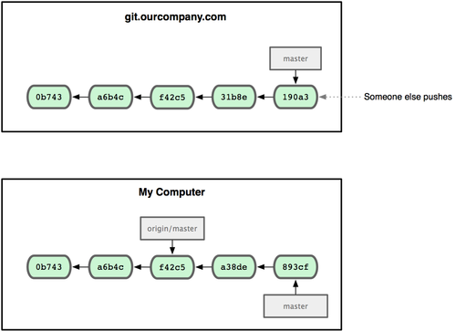 

图 23. 在本地工作的同时有人向远程仓库推送内容会让提交历史开始分流。

可以运行 git fetch origin 来同步远程服务器上的数据到本地。该命令首先找到 origin 是哪个服务器，从上面获取你尚未拥有的数据，更新你本地的数据库，然后把 origin/master 的指针移到它最新的位置上（见图 24）

 

图 24. git fetch 命令会更新 remote 索引。

为了演示拥有多个远程分支（在不同的远程服务器上）的项目是如何工作的，我们假设你还有另一个仅供你的敏捷开发小组使用的内部服务器 git.team1.ourcompany.com。可以用我上面提到的 git remote add 命令把它加为当前项目的远程分支之一。我们把它命名为 teamone，以便代替完整的 Git URL 以方便使用（见图 25）
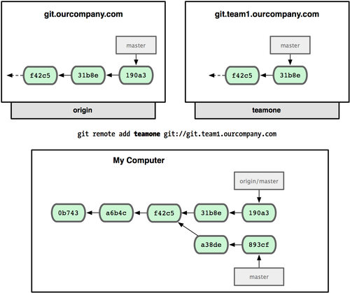 

图 2-25. 把另一个服务器加为远程仓库

现在你可以用 git fetch teamone 来获取小组服务器上你还没有的数据了。由于当前该服务器上的内容是你 origin 服务器上的子集，Git 不会下载任何数据，而只是简单地创建一个名为 teamone/master 的远程分支，指向 teamone 服务器上 master 分支所在的提交对象31b8e（见图 26）。

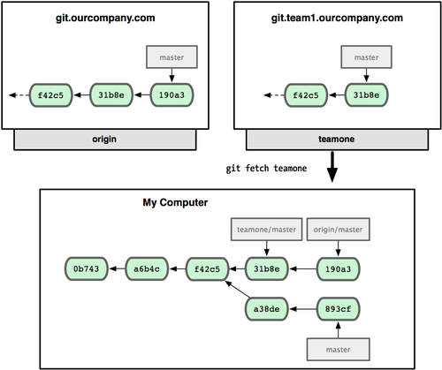 

图 26. 你在本地有了一个指向 teamone 服务器上 master 分支的索引。

### 6、推送本地分支

要想和其他人分享某个本地分支，你需要把它推送到一个你拥有写权限的远程仓库。你创建的本地分支不会因为你的写入操作而被自动同步到你引入的远程服务器上，你需要明确地执行推送分支的操作。换句话说，对于无意分享的分支，你尽管保留为私人分支好了，而只推送那些协同工作要用到的特性分支。

如果你有个叫 serverfix 的分支需要和他人一起开发，可以运行 git push (远程仓库名) (分支名)：

```sh
$ git push origin serverfix
   # Counting objects: 20, done.
   # Compressing objects: 100% (14/14), done.
   # Writing objects: 100% (15/15), 1.74 KiB, done.
   # Total 15 (delta 5), reused 0 (delta 0)
   # To git@github.com:schacon/simplegit.git
   # * [new branch] serverfix -> serverfix
```
这里Git 会自动把 serverfix 分支名扩展为 refs/heads/serverfix:refs/heads/serverfix，意为“取出我在本地的 serverfix 分支，推送到远程仓库的 serverfix 分支中去”。也可以运行 git push origin serverfix:serverfix 来实现相同的效果，它的意思是“上传我本地的 serverfix 分支到远程仓库中去，仍旧称它为 serverfix 分支”。通过此语法，你可以把本地分支推送到某个命名不同的远程分支：若想把远程分支叫作 awesomebranch，可以用 git push origin serverfix:awesomebranch 来推送数据。

接下来，当你的协作者再次从服务器上获取数据时，他们将得到一个新的远程分支 origin/serverfix，并指向服务器上 serverfix 所指向的版本：

```sh
$ git fetch origin
   # remote: Counting objects: 20, done.
   # remote: Compressing objects: 100% (14/14), done.
   # remote: Total 15 (delta 5), reused 0 (delta 0)
   # Unpacking objects: 100% (15/15), done.
   # From git@github.com:schacon/simplegit
   # * [new branch] serverfix -> origin/serverfix
```
值得注意的是，在 fetch 操作下载好新的远程分支之后，你仍然无法在本地编辑该远程仓库中的分支。换句话说，在本例中，你不会有一个新的 serverfix 分支，有的只是一个你无法移动的 origin/serverfix 指针。

如果要把该远程分支的内容合并到当前分支，可以运行 git merge origin/serverfix。如果想要一份自己的 serverfix 来开发，可以在远程分支的基础上分化出一个新的分支来：

```sh
$ git checkout -b serverfix origin/serverfix
   # Branch serverfix set up to track remote branch refs/remotes/origin/serverfix.
   # Switched to a new branch "serverfix"
```
这会切换到新建的 serverfix 本地分支，其内容同远程分支 origin/serverfix 一致，这样你就可以在里面继续开发了。

### 7、跟踪远程分支

从远程分支 checkout 出来的本地分支，称为 跟踪分支 (tracking branch)。跟踪分支是一种和某个远程分支有直接联系的本地分支。在跟踪分支里输入 git push，Git 会自行推断应该向哪个服务器的哪个分支推送数据。同样，在这些分支里运行 git pull 会获取所有远程索引，并把它们的数据都合并到本地分支中来。

在克隆仓库时，Git 通常会自动创建一个名为 master 的分支来跟踪 origin/master。这正是 `git push` 和 `git pull` 一开始就能正常工作的原因。当然，你可以随心所欲地设定为其它跟踪分支，比如 origin 上除了 master 之外的其它分支。刚才我们已经看到了这样的一个例子：`git checkout -b` [分支名] [远程名]/[分支名]。如果你有 1.6.2 以上版本的 Git，还可以用 --track 选项简化：

```sh
$ git checkout --track origin/serverfix
   # Branch serverfix set up to track remote branch refs/remotes/origin/serverfix.
   # Switched to a new branch "serverfix"
```
要为本地分支设定不同于远程分支的名字，只需在第一个版本的命令里换个名字：

```sh
$ git checkout -b sf origin/serverfix
   # Branch sf set up to track remote branch refs/remotes/origin/serverfix.
   # Switched to a new branch "sf"
```
现在你的本地分支 sf 会自动将推送和抓取数据的位置定位到 origin/serverfix 了。

### 8、删除远程分支

如果不再需要某个远程分支了，比如搞定了某个特性并把它合并进了远程的 master 分支（或任何其他存放稳定代码的分支），可以用这个非常无厘头的语法来删除它：git push [远程名] :[分支名]。如果想在服务器上删除 serverfix 分支，运行下面的命令：

```sh
$ git push origin :serverfix
   # To git@github.com:schacon/simplegit.git
   # - [deleted] serverfix
```
咚！服务器上的分支没了。你最好特别留心这一页，因为你一定会用到那个命令，而且你很可能会忘掉它的语法。有种方便记忆这条命令的方法：记住我们不久前见过的 `git push` [远程名] [本地分支]:[远程分支] 语法，如果省略 [本地分支]，那就等于是在说“在这里提取空白然后把它变成[远程分支]”。

### 9、分支的衍合

把一个分支中的修改整合到另一个分支的办法有两种：merge 和 rebase。

#### a.基本的衍合操作

请回顾我上面讲到的合并（见图 27），你会看到开发进程分叉到两个不同分支，又各自提交了更新。

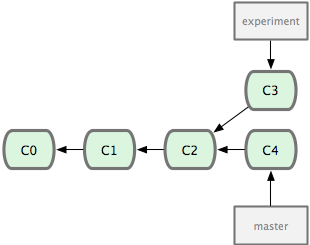   

图 27. 最初分叉的提交历史。

前面介绍过，最容易的整合分支的方法是 merge 命令，它会把两个分支最新的快照（C3 和 C4）以及二者最新的共同祖先（C2）进行三方合并，合并的结果是产生一个新的提交对象（C5）。如图 28 所示：

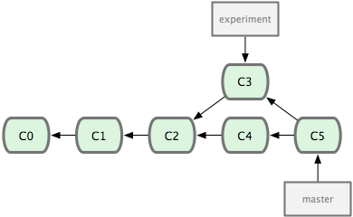   
图 28. 通过合并一个分支来整合分叉了的历史。

其实，还有另外一个选择：你可以把在 C3 里产生的变化补丁在 C4 的基础上重新打一遍。在 Git 里，这种操作叫做衍合（rebase）。有了 rebase 命令，就可以把在一个分支里提交的改变移到另一个分支里重放一遍。

在上面这个例子中，运行：

```sh
$ git checkout experiment
   # $ git rebase master
   # First, rewinding head to replay your work on top of it...
   # Applying: added staged command
```
它的原理是回到两个分支最近的共同祖先，根据当前分支（也就是要进行衍合的分支 experiment）后续的历次提交对象（这里只有一个 C3），生成一系列文件补丁，然后以基底分支（也就是主干分支 master）最后一个提交对象（C4）为新的出发点，逐个应用之前准备好的补丁文件，最后会生成一个新的合并提交对象（C3'），从而改写 experiment 的提交历史，使它成为 master 分支的直接下游，如图 29 所示：

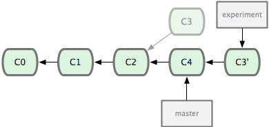   
图 29. 把 C3 里产生的改变到 C4 上重演一遍。

现在回到 master 分支，进行一次快进合并（见图 30）：

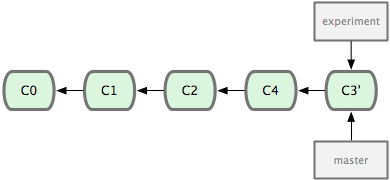 
图 30. master 分支的快进。

现在的 C3' 对应的快照，其实和普通的三方合并，即上个例子中的 C5 对应的快照内容一模一样了。虽然最后整合得到的结果没有任何区别，但衍合能产生一个更为整洁的提交历史。如果视察一个衍合过的分支的历史记录，看起来会更清楚：仿佛所有修改都是在一根线上先后进行的，尽管实际上它们原本是同时并行发生的。

一般我们使用衍合的目的，是想要得到一个能在远程分支上干净应用的补丁 — 比如某些项目你不是维护者，但想帮点忙的话，最好用衍合：先在自己的一个分支里进行开发，当准备向主项目提交补丁的时候，根据最新的 origin/master 进行一次衍合操作然后再提交，这样维护者就不需要做任何整合工作（实际上是把解决分支补丁同最新主干代码之间冲突的责任，化转为由提交补丁的人来解决），只需根据你提供的仓库地址作一次快进合并，或者直接采纳你提交的补丁。

请注意，合并结果中最后一次提交所指向的快照，无论是通过衍合，还是三方合并，都会得到相同的快照内容，只不过提交历史不同罢了。衍合是按照每行的修改次序重演一遍修改，而合并是把最终结果合在一起。

#### b.有趣的衍合

衍合也可以放到其他分支进行，并不一定非得根据分化之前的分支。以图 31 的历史为例，我们为了给服务器端代码添加一些功能而创建了特性分支 server，然后提交 C3 和 C4。然后又从 C3 的地方再增加一个 client 分支来对客户端代码进行一些相应修改，所以提交了 C8 和 C9。最后，又回到 server 分支提交了 C10。
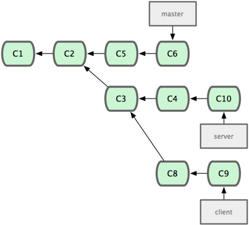 

图 31. 从一个特性分支里再分出一个特性分支的历史。

假设在接下来的一次软件发布中，我们决定先把客户端的修改并到主线中，而暂缓并入服务端软件的修改（因为还需要进一步测试）。这个时候，我们就可以把基于 server 分支而非 master 分支的改变（即 C8 和 C9），跳过 server 直接放到 master 分支中重演一遍，但这需要用 `git rebase` 的 --onto 选项指定新的基底分支 master：
```sh
$ git rebase --onto master server client
```
这好比在说：“取出 client 分支，找出 client 分支和 server 分支的共同祖先之后的变化，然后把它们在 master 上重演一遍”。它的结果如图 32 所示（译注：虽然 client 里的 C8, C9 在 C3 之后，但这仅表明时间上的先后，而非在 C3 修改的基础上进一步改动，因为 server 和 client 这两个分支对应的代码应该是两套文件，虽然这么说不是很严格，但应理解为在 C3 时间点之后，对另外的文件所做的 C8，C9 修改，放到主干重演。）：

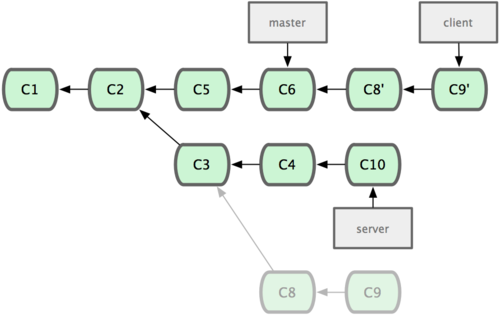   

图 32. 将特性分支上的另一个特性分支衍合到其他分支。

现在可以快进 master 分支了（见图 33）：

```sh
# step 1
$ git checkout master
# step 2
$ git merge client
```
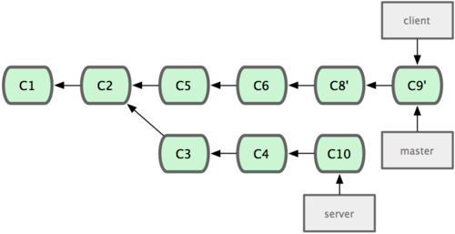 
图 33. 快进 master 分支，使之包含 client 分支的变化。

现在我们决定把 server 分支的变化也包含进来。我们可以直接把 server 分支衍合到 master，而不用手工切换到 server 分支后再执行衍合操作 — git rebase [主分支] [特性分支] 命令会先取出特性分支 server，然后在主分支 master 上重演：

```sh
$ git rebase master server
```
于是，server 的进度应用到 master 的基础上，如图 34 所示：

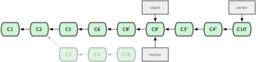 

图 34. 在 master 分支上衍合 server 分支。

然后就可以快进主干分支 master 了：

```sh
# step 1
$ git checkout master
# step 2
$ git merge server
```
现在 client 和 server 分支的变化都已经集成到主干分支来了，可以删掉它们了。最终我们的提交历史会变成图 35 的样子：

```sh
# step 1
$ git branch -d client
# step 2
$ git branch -d server
```
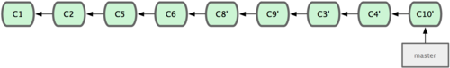 
图 35. 最终的提交历史

 

这里需要强调一点的是，使用衍合的时候必须遵守一条准则：

一旦分支中的提交对象发布到公共仓库，就千万不要对该分支进行衍合操作。


